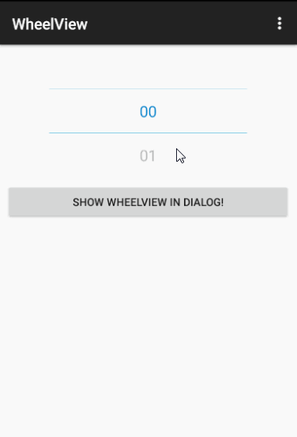
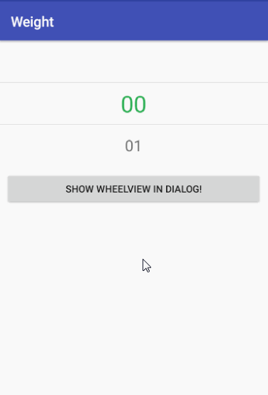

WheelView
=========

## explain
之前使用了wangjiegulu大神造的WheelView
https://github.com/wangjiegulu/WheelView

觉得有两点缺陷。

1，滑动速度很快的时候，要很长时间才会停下来，用户要等待很久。

2，滑动将要停止的时候很大概率会发生回转，感觉有点难受。

所以就在wangjiegulu大神的基础上做了一番改造。

如图，图1是原版效果，图2是我改造后的效果。




## How to use

### layout:
```xml
<com.vinnie.weight.WheelView
    android:id="@+id/wheel_view"
    android:layout_width="match_parent"
    android:layout_height="wrap_content"
    />
```

### Activity:
```java
WheelView wv = findViewById(R.id.wheel_view);
wv.setOffset(1);
wv.setItems(Arrays.asList(PLANETS));
wv.setOnWheelViewListener(new WheelView.OnWheelViewListener() {
    @Override
    public void onSelected(int selectedIndex, String item) {
        Log.d(TAG, "selectedIndex: " + selectedIndex + ", item: " + item);
    }
});
```

#### Show in dialog:
```java
View outerView = LayoutInflater.from(this).inflate(R.layout.wheel_view, null);
WheelView wv = (WheelView) outerView.findViewById(R.id.wheel_view_wv);
wv.setOffset(2);
wv.setItems(Arrays.asList(PLANETS));
wv.setSelection(3);
wv.setOnWheelViewListener(new WheelView.OnWheelViewListener() {
    @Override
    public void onSelected(int selectedIndex, String item) {
        Log.d(TAG, "[Dialog]selectedIndex: " + selectedIndex + ", item: " + item);
    }
});

new AlertDialog.Builder(this)
        .setTitle("WheelView in Dialog")
        .setView(outerView)
        .setPositiveButton("OK", null)
        .show();
```
    
License
=======

    Copyright 2018 Vinnie

    Licensed under the Apache License, Version 2.0 (the "License");
    you may not use this file except in compliance with the License.
    You may obtain a copy of the License at

       http://www.apache.org/licenses/LICENSE-2.0

    Unless required by applicable law or agreed to in writing, software
    distributed under the License is distributed on an "AS IS" BASIS,
    WITHOUT WARRANTIES OR CONDITIONS OF ANY KIND, either express or implied.
    See the License for the specific language governing permissions and
    limitations under the License.


[](https://android-arsenal.com/details/1/1433)
